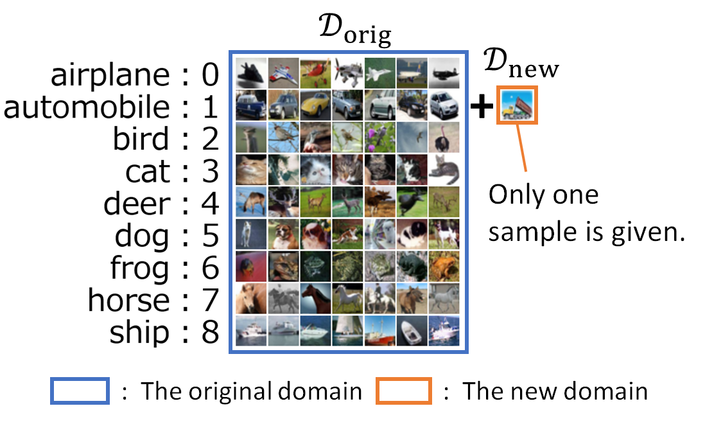

# One-Shot Domain Incremental Learning

This is an official Pytorch implementation of "One-Shot Domain Incremental Learning". [[arXiv](https://doi.org/10.48550/arXiv.2403.16707)|[IEEE Xplore](https://doi.org/10.1109/IJCNN60899.2024.10650928)]

<div align="center">

</div>

## Preparation

1. Git clone this repository.
   
    ```bash
    git clone https://github.com/ToyotaCRDL/OneShotDIL.git
    ```

2. Build a Docker image using `Dockerfile` and `requrements.txt`.

    ```bash
    docker build --build-arg USER=${USER} -t one-shot-dil OneShotDIL
    ```

3. Launch a container.

    ```bash
    docker run -it --rm --gpus all \
            --mount type=bind,source=$(pwd)/OneShotDIL,target=${HOME}/OneShotDIL \
            --workdir ${HOME}/OneShotDIL \
            one-shot-dil
    ```

We conducted our experiments on a NVIDIA A100 GPU.


## Training

- The following is a demonstration of CIFAR10.

  1. Train a model using only the original domain.

      ```bash
      bash scripts/cifar10/only_original_domain.sh
      ```

  2. Perform one-shot domain incremental learning using the new domain.

      - Standard method (updated-stats)

          ```bash
          bash scripts/cifar10/updated_stats_dil.sh
          ```
      
      - Proposed method (fixed-stats)

          ```bash
          bash scripts/cifar10/fixed_stats_dil.sh
        ```

## Evaluation

- Calculate the test accuracy before and after performing one-shot domain incremental learning.

    - Standard method (updated-stats)

        ```bash
        bash scripts/cifar10/updated_stats_eval.sh
        ```

    - Proposed method (fixed-stats)
  
        ```bash
        bash scripts/cifar10/fixed_stats_eval.sh
        ```

## Citation

To cite our work, you can use the following:

```bibtex
@inproceedings{OneShotDIL,
  author={Esaki, Yasushi and Koide, Satoshi and Kutsuna, Takuro},
  booktitle={2024 International Joint Conference on Neural Networks (IJCNN)}, 
  title={One-Shot Domain Incremental Learning}, 
  year={2024},
  doi={10.1109/IJCNN60899.2024.10650928}
}
```


## License

Copyright (C) 2025 TOYOTA CENTRAL R&D LABS., INC. All Rights Reserved.